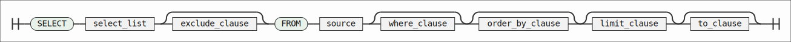
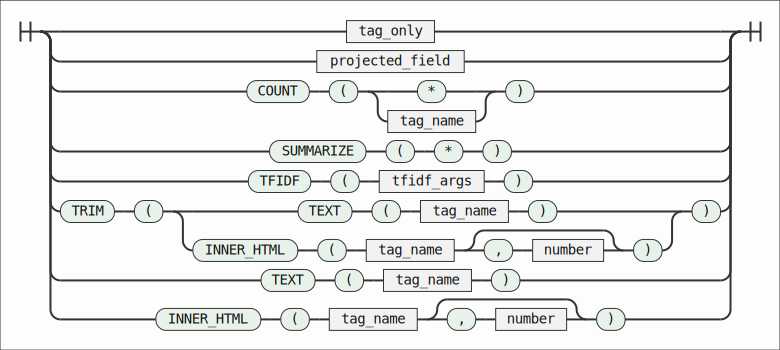
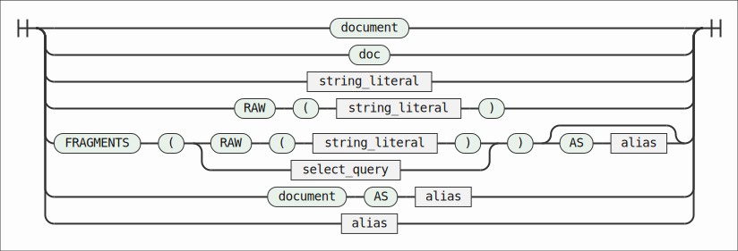
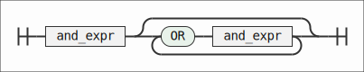
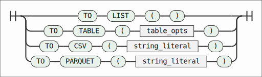

# XSQL Documentation (v1.3.1)

XSQL is a SQL-style query language for static HTML. It treats each HTML element
as a row in a node table and lets you filter by tag, attributes, and position.
The project is now at v1.3.1 as an offline-first C++20 tool.

## Quick Start

Build:
```
./build.sh
```

Run on a file:
```
./build/xsql --query "SELECT a FROM doc WHERE id = 'login'" --input ./data/index.html
```

Interactive mode:
```
./build/xsql --interactive --input ./data/index.html
```

## Python API (xsql package)

```python
import xsql

# Load local HTML file and execute query
doc = xsql.load("data/test.html")
result1 = xsql.execute("SELECT a.href FROM document WHERE href CONTAINS ANY ('http', 'https')")

print("result1:")
for row in result1.rows:
    print(row.get('href'))

# Load remote HTML file with network access and execute query
doc = xsql.load("https://example.com", allow_network=True)
result2 = xsql.execute("SELECT p FROM doc")

print("result2:")
for row in result2.rows:
    print(row)
```

Install:
```
pip install pyxsql
```

Security Notes:
- Network access is disabled by default; enable with `allow_network=True`.
- Private/localhost targets are blocked unless `allow_private_network=True`.
- File reads are confined to `base_dir` when provided.
- Downloads are capped by `max_bytes`, and query output by `max_results`.

## Build on Linux/macOS/Windows

Linux (Ubuntu/Debian):
```
sudo apt-get update
sudo apt-get install -y build-essential cmake ninja-build pkg-config bison flex
./build.sh
```

macOS (Homebrew):
```
brew install cmake ninja pkg-config bison flex
./build.sh
```

Windows (PowerShell, MSVC):
```
cmake -S . -B build -DCMAKE_TOOLCHAIN_FILE=C:\vcpkg\scripts\buildsystems\vcpkg.cmake -DVCPKG_TARGET_TRIPLET=x64-windows
cmake --build build --config Release
```

Optional dependencies via vcpkg:
```
vcpkg install nlohmann-json libxml2 curl arrow[parquet]
```

If you do not want Parquet, configure with `-DXSQL_WITH_ARROW=OFF`.

## Python Build & Tests

Create a virtual environment and install the editable package:
```
python3 -m venv xsql_venv
source ./xsql_venv/bin/activate
pip install -U pip
pip install -e .[test]
```

Run Python tests:
```
pytest -v python/tests
```

Shorthand:
```
./install_python.sh
./test_python.sh
```

## CLI Usage

```
./build/xsql --query "<query>" --input <path>
./build/xsql --query-file <file> --input <path>
./build/xsql --interactive [--input <path>]
./build/xsql --mode duckbox|json|plain
./build/xsql --display_mode more|less
./build/xsql --highlight on|off
./build/xsql --color=disabled
```

Notes:
- `--input` is required unless reading HTML from stdin.
- Colors are auto-disabled when stdout is not a TTY.
- Default output mode is `duckbox` (table-style).
- Duckbox output prints a footer row count.
- `--highlight` only affects duckbox headers (auto-disabled when not a TTY).
- `--display_mode more` disables JSON truncation in non-interactive mode.
- `TO CSV()` / `TO PARQUET()` write files instead of printing results.

## Interactive Mode (REPL)

Commands:
- `.help`: show help
- `.load <path|url> [--alias <name>]` / `:load <path|url> [--alias <name>]`: load input (path or URL)
- `.mode duckbox|json|plain`: set output mode
- `.display_mode more|less`: control JSON truncation
- `.max_rows <n|inf>`: set duckbox max rows (`inf` = unlimited)
- `.reload_config`: reload REPL config from disk
- `.summarize [doc|alias|path|url]`: list all tags and counts for the active input or target
- `.quit` / `.q` / `:quit` / `:exit`: exit the REPL

Keys:
- Up/Down: history (max 5 entries)
- Left/Right: move cursor
- Ctrl+L: clear screen
- Tab: autocomplete keywords/functions/commands

Tip:
- Use `.load --alias doc1` to register multiple sources and query them via `FROM doc1`.

## Khmer Number Module (Optional)

Install the plugin (REPL):
```
.plugin install number_to_khmer
.plugin load number_to_khmer
```

Enable at build time (built-in commands):
```
cmake -S . -B build -DXSQL_ENABLE_KHMER_NUMBER=ON
cmake --build build
```

REPL commands:
- `.number_to_khmer <number> [--compact] [--khmer-digits]`
- `.khmer_to_number <khmer_text> [--khmer-digits]`

Example:
```
xsql> .number_to_khmer 12.30
ដប់-ពីរ-ក្បៀស-បី-សូន្យ
xsql> .number_to_khmer --compact 12.30
ដប់ពីរក្បៀសបីសូន្យ
xsql> .number_to_khmer --khmer-digits 12.30
១២.៣០
xsql> .khmer_to_number ដក-មួយ-រយ-ក្បៀស-ប្រាំ-សូន្យ
-100.50
xsql> .khmer_to_number --khmer-digits ដប់-ពីរ
១២
```

Formatting rules:
- Tokens are joined with `-` (the parser also accepts whitespace).
- Reverse parsing also accepts concatenated Khmer number words without separators.
- Decimal marker token: `ក្បៀស`
- Negative marker token: `ដក`
- Integer zeros are omitted unless the entire integer part is zero (`សូន្យ`).
- Decimal digits are emitted one-by-one and preserved (including trailing zeros).
- `--khmer-digits` outputs Khmer digits (0-9 => ០-៩) with `.` as the decimal point.
- Scales are defined up to 10^36; the module is CLI-only for now.

## Playwright Fetch Plugin (Experimental)

This optional plugin renders dynamic pages in headless Chromium via Playwright (Node)
and saves the HTML for `.load`.

Setup:
```
cd plugins/playwright_fetch
npm install
npx playwright install chromium
cmake -S plugins/cmake/playwright_fetch -B plugins/cmake/playwright_fetch/build -DXSQL_ROOT=/path/to/XSQL
cmake --build plugins/cmake/playwright_fetch/build
```

Usage:
```
./build/xsql --interactive
.plugin load playwright_fetch
.fetch "https://example.com/app" --out /tmp/page.html --state /tmp/state.json
.load /tmp/page.html
```

Options:
- `.fetch <url>` fetches and renders the page.
- `--out <path>` writes HTML output (default: `<cache>/last.html`).
- `--state [path]` loads/saves storage state (default: `<cache>/state.json` when provided).
- `--cache-dir <path>` sets the cache directory.
- `--timeout <ms>` sets navigation timeout (default: `60000`).
- `--wait <selector>` waits for a CSS selector after navigation.
- `--headed` launches a visible browser for manual interaction.
- `--pause` waits for Enter before capturing HTML (implies `--headed`).
- `--clean` deletes the cache directory.

Cache directory:
- Defaults to `$XDG_CACHE_HOME/xsql/playwright_fetch` or `~/.cache/xsql/playwright_fetch`.
- Override with `XSQL_FETCH_CACHE_DIR` or `--cache-dir`.

Environment overrides:
- `XSQL_NODE` to select the Node.js binary.
- `XSQL_PLAYWRIGHT_FETCH_SCRIPT` to point to a custom `fetch.js`.

## REPL Config (TOML)

The REPL reads a TOML config file at `$XDG_CONFIG_HOME/xsql/config.toml`
or `~/.config/xsql/config.toml`. Reload it with `.reload_config`.

Example:
```toml
[repl]
output_mode = "duckbox"
display_mode = "more"
max_rows = 40
highlight = true

[repl.history]
max_entries = 500
path = "~/.local/state/xsql/history"
```

## Data Model

Each HTML element becomes a row with fields:
- `node_id` (int64)
- `tag` (string)
- `attributes` (map<string,string>)
- `parent_id` (int64 or null)
- `sibling_pos` (int64, 1-based position among siblings)
- `source_uri` (string)

Notes:
- `source_uri` is stored for provenance but hidden from default output unless multiple sources appear.

## Query Language

## Syntax Diagrams

Railroad diagrams are auto-generated for the current parser. Rebuild with
`python3 docs/generate_diagrams.py` after installing `docs/requirements.txt`.

Query shape:


Select queries:


Select items:


Sources:


Where expressions:


Output clauses:


Notes:
- Tag-only selections cannot mix with projected fields.
- Shorthand attributes (e.g., `href = '...'`) are parsed as `attributes.href`.
- Semicolon is optional, but the REPL requires it to end a statement on a single line.

### Basic Form
```
SELECT <tag_list> FROM <source> [WHERE <expr>] [LIMIT <n>]
  [TO LIST() | TO TABLE([HEADER=ON|OFF][, EXPORT='file.csv']) | TO CSV('file.csv') | TO PARQUET('file.parquet')]
```

### Source
```
FROM document
FROM 'path.html'
FROM 'https://example.com'   (URL fetching requires libcurl)
FROM RAW('<div class="card"></div>')
FROM FRAGMENTS(RAW('<ul><li>1</li><li>2</li></ul>')) AS frag
FROM FRAGMENTS(SELECT inner_html(div) FROM doc WHERE class = 'pagination') AS frag
FROM doc                     (alias for document)
FROM document AS doc
```

Notes:
- `RAW('<html>')` parses an inline HTML string as the document source.
- `FRAGMENTS(...)` builds a temporary document by concatenating HTML fragments.
- `FRAGMENTS` accepts either `RAW('<html>')` or a subquery returning a single HTML string column (use `inner_html(...)`).
- `FRAGMENTS` subqueries cannot use file or URL sources.

### Meta Queries
```
SHOW INPUT;
SHOW INPUTS;
SHOW FUNCTIONS;
SHOW AXES;
SHOW OPERATORS;
DESCRIBE doc;
DESCRIBE language;
```

Notes:
- `SHOW INPUT` reports the active source.
- `SHOW INPUTS` lists distinct sources from the last result (or the active source if none).
- `DESCRIBE doc` shows the base schema; axes are documented via `SHOW AXES`.
- `DESCRIBE language` lists the SQL language surface as a single table.

### Tags
```
SELECT div
SELECT div,span
SELECT *
```

Exclude columns:
```
SELECT * EXCLUDE source_uri FROM doc
SELECT * EXCLUDE (source_uri, tag) FROM doc
```

### Axes (Relationship Selectors)
```
parent
child
ancestor
descendant
```

### WHERE Expressions
Supported operators:
- `=`
- `IN`
- `<>` / `!=`
- `IS NULL` / `IS NOT NULL`
- `~` (regex, ECMAScript)
- `CONTAINS` (attributes only, case-insensitive)
- `HAS_DIRECT_TEXT` (case-insensitive substring match on direct text)
- `AND`, `OR`

Attribute references (shorthand):
```
id = 'main'
parent.class = 'menu'
child.href <> ''
ancestor.id = 'root'
descendant.class IN ('nav','top')
href CONTAINS 'example'
```

Field references:
```
text <> ''
tag = 'div'
parent.tag = 'section'
child.tag = 'a'
ancestor.text ~ 'error|warning'
div HAS_DIRECT_TEXT 'login'
sibling_pos = 2
```

Shorthand attribute filters (default):
```
title = "Menu"
doc.title = "Menu"
```

Longhand attribute filters (optional for clarity):
```
attributes.title = "Menu"
doc.attributes.title = "Menu"
```

### Aliases
Alias the source and qualify attribute filters:
```
SELECT a FROM document AS d WHERE d.id = 'login'
```

### Projections
Project a field from a tag:
```
SELECT a.parent_id FROM doc
SELECT link.href FROM doc
SELECT a.attributes FROM doc
SELECT div(node_id, tag, parent_id) FROM doc
```

Supported base fields:
- `node_id`, `tag`, `parent_id`, `sibling_pos`, `max_depth`, `doc_order`, `source_uri`, `attributes`

Attribute value projection:
- `SELECT link.href FROM doc` returns the `href` value

Function projection:
- `SELECT inner_html(div) FROM doc` returns the raw inner HTML for each `div`
- `SELECT inner_html(div, 1) FROM doc` keeps only tags up to depth 1 (drops deeper tags)
- `SELECT trim(inner_html(div)) FROM doc` trims leading/trailing whitespace
- `SELECT TEXT(div) FROM doc WHERE tag = 'div'` returns descendant text for each `div`
- `SELECT FLATTEN_TEXT(div) AS (c1, c2) FROM doc WHERE descendant.tag IN ('p','span')` flattens text at the deepest depth

Notes:
- `TEXT()` and `INNER_HTML()` require a `WHERE` clause with a non-tag filter (e.g., attributes or parent).
- `attributes IS NULL` matches elements with no attributes.
- `FLATTEN_TEXT()` defaults to all descendant elements (and respects `descendant.tag`); missing columns are padded with NULL and extra values are truncated.
- `FLATTEN_TEXT()` uses `descendant.tag = '...'`/`IN (...)` and `descendant.attributes.<attr>` with `=`, `IN`, `CONTAINS`, `CONTAINS ALL`, or `CONTAINS ANY` to filter flattened elements.
- `FLATTEN_TEXT()` extracts direct text from the matched element and falls back to inline descendant text when direct text is empty or whitespace-only; output is trimmed and whitespace-collapsed. When depth is omitted, empty-text nodes are skipped.
- `FLATTEN_TEXT(base, depth)` targets the exact element depth from `base` (0 = base itself).
- `FLATTEN_TEXT(base)` defaults to a single output column named `flatten_text` when no `AS (...)` list is provided.

### TO LIST()
Output a JSON list for a single projected column:
```
SELECT link.href FROM doc WHERE rel = "preload" TO LIST()
```

### TO TABLE()
Extract an HTML `<table>` into rows (array of arrays). By default the first row
is treated as column headers for duckbox rendering; set `HEADER=OFF` to render
all rows as data (CSV exports will include generated `col1..colN` headers):
```
SELECT table FROM doc TO TABLE()
SELECT table FROM doc TO TABLE(HEADER=OFF)
SELECT table FROM doc WHERE id = 'stats' TO TABLE(EXPORT='stats.csv')
```

If multiple tables match, the output is a list of objects:
```
[{ "node_id": 123, "rows": [[...], ...] }, ...]
```

Note: `TO LIST()` always returns JSON output. `TO TABLE()` uses duckbox by default and JSON in `--mode json|plain`.
`EXPORT='file.csv'` requires a single table result, so filter by `node_id` or attributes when multiple tables match.

### TO CSV()
Write any rectangular result to a CSV file:
```
SELECT a.href, a.text FROM doc WHERE href IS NOT NULL TO CSV('links.csv')
```

### TO PARQUET()
Write any rectangular result to a Parquet file (requires Apache Arrow feature):
```
SELECT * FROM doc TO PARQUET('nodes.parquet')
```

Note: `TO CSV()` and `TO PARQUET()` write files and do not print the result set.
If you `SELECT table ... TO CSV(...)`, XSQL exports the HTML table rows directly (legacy).
Prefer `TO TABLE(EXPORT='file.csv')` for explicit table exports.

### LIMIT
```
SELECT a FROM doc LIMIT 5
```

### COUNT()
Minimal aggregate:
```
SELECT COUNT(a) FROM doc
SELECT COUNT(*) FROM doc
SELECT COUNT(link) FROM doc WHERE rel = "preload"
```

### Regex
Use `~` with ECMAScript regex:
```
SELECT a FROM doc WHERE href ~ '.*\\.pdf$'
```

### Contains (attributes)
Case-insensitive substring match for attribute values:
```
SELECT a FROM doc WHERE href CONTAINS 'techkhmer'
SELECT a FROM doc WHERE href CONTAINS ALL ('https', '.html')
SELECT a FROM doc WHERE href CONTAINS ANY ('https', 'mailto')
```

### Direct Text
Case-insensitive substring match on direct text only (excluding nested tags):
```
SELECT div FROM doc WHERE div HAS_DIRECT_TEXT 'computer science'
```

### TFIDF()
Compute per-node TF-IDF scores across the matched nodes. Each matched node is
treated as a document in the IDF corpus.
```
SELECT TFIDF(p, li, TOP_TERMS=30, MIN_DF=1, MAX_DF=0, STOPWORDS=ENGLISH)
  FROM doc WHERE class = 'article'
```

Output columns: `node_id`, `parent_id`, `tag`, `terms_score` (term → score map).

Options:
- `TOP_TERMS` (default 30): max terms per node.
- `MIN_DF` (default 1): minimum document frequency.
- `MAX_DF` (default 0 = no max): maximum document frequency.
- `STOPWORDS` (`ENGLISH` or `NONE`, default `ENGLISH`).

Notes:
- Tags must come before options inside `TFIDF(...)`.
- TFIDF is an aggregate and must be the only select item.
- TFIDF ignores HTML tags and skips script/style/noscript content.

## Examples

```
-- Filters
SELECT ul FROM doc WHERE id = 'countries';
SELECT table FROM doc WHERE parent.id = 'table-01';
SELECT div FROM doc WHERE descendant.class = 'card';
SELECT span FROM doc WHERE parent_id = 1;
SELECT span FROM doc WHERE node_id = 1;
SELECT div FROM doc WHERE attributes IS NULL;

-- Lists and exports
SELECT link.href FROM doc WHERE rel = "preload" TO LIST();
SELECT a.href, a.text FROM doc WHERE href IS NOT NULL TO CSV('links.csv');
SELECT * FROM doc TO PARQUET('nodes.parquet');

-- Fragments
SELECT li FROM FRAGMENTS(SELECT inner_html(ul) FROM doc WHERE id = 'menu') AS frag;

-- Ordering
SELECT div FROM doc ORDER BY node_id DESC;
SELECT * FROM doc ORDER BY tag, parent_id LIMIT 10;

-- Summaries
SELECT summarize(*) FROM doc;
SELECT summarize(*) FROM doc ORDER BY count DESC LIMIT 5;
```

## TODO

| Item | Priority |
| --- | --- |
| Plugin for dynamic websites (headless browser fetch/render) | Highest |
| DOM mutation: `UPDATE` / `INSERT` / `DELETE` | High |
| DOM mutation: attribute ops (`SET`, `REMOVE`) | High |
| DOM mutation: content ops (`SET TEXT`, `SET INNER_HTML`) | High |
| DB bridge: `TO DB()` / `FROM DB()` (XSQL stays front-end) | High |
| Multi-source `JOIN` (doc ↔ doc, doc ↔ table) | Medium |
| `WITH` / subqueries for reuse | Medium |
| `GROUP BY` + `HAVING` + `DISTINCT` | Medium |
| Performance profiling + hot-path optimizations | Medium |
| Session cache for parsed DOM (if a clear use case appears) | Low |
| BM25 ranking (simple explainer on demand) | Exploration |

## Known Limitations

- No XPath or positional predicates.
- `ORDER BY` is limited to `node_id`, `tag`, `text`, or `parent_id`.
- No `GROUP BY` or joins.
- No XML mode (HTML only).
- URL fetching requires libcurl.
- Default output is duckbox tables; JSON output is available via `--mode json`.
- `TO PARQUET()` requires Apache Arrow support at build time.

## Build Dependencies

Optional:
- `nlohmann/json` for pretty JSON output (vcpkg recommended).
- `libxml2` for robust HTML parsing (fallback to naive parser if missing).
- `libcurl` for URL fetching.
- `apache-arrow` (Arrow/Parquet) for `TO PARQUET()` export.

## Troubleshooting

- If you see `No input loaded` in REPL, run `:load <path|url>`.
- If a query fails with `Expected FROM`, include a `FROM` clause.
- If output is compact JSON, ensure `nlohmann/json` is linked via vcpkg.
